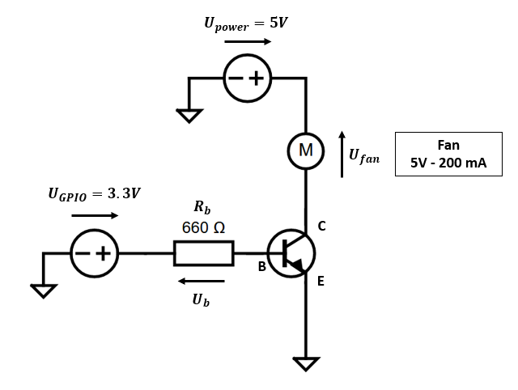
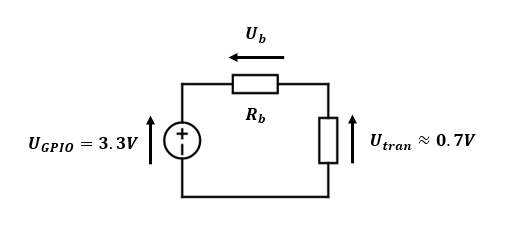
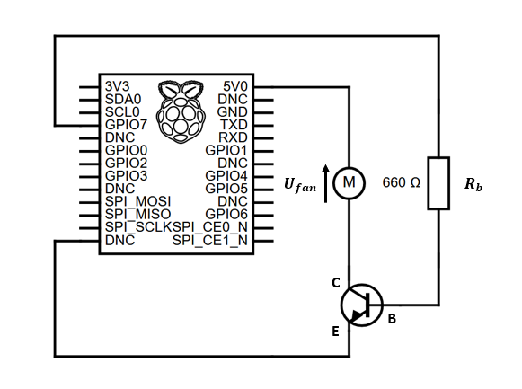

<!-- PROJECT LOGO -->
<br />
<p align="center">
  <a href="https://github.com/JorisCaze/rpi-fan">
    <!--  -->
    
  </a>
  <h3 align="center">Raspberry Pi fan control</h3>
</p>

Icons made by [Freepik]("https://www.freepik.com") from [flaticon]("https://www.flaticon.com/).

<!-- TABLE OF CONTENTS -->
<details open="open">
  <summary>Table of Contents</summary>
  <ol>
    <li>
      <a href="#overview">Overview</a>
    </li>
    <li>
      <a href="#getting-started">Getting Started</a>
      <ul>
        <li><a href="#electronic-circuit">Electronic circuit</a></li>
        <li><a href="#script-installation">Script installation</a></li>
      </ul>
    </li>
    <li><a href="#license">License</a></li>
    <li><a href="#references">References</a></li>
  </ol>
</details>


<!-- OVERVIEW -->
## Overview

This little tool allows to control a Raspberry Pi 5V fan according to high/low temperature thresholds.

It should be noted that it is possible to run a fan directly by connecting it to a 5V pin (or 3.3V for lower speed/noise) and a ground pin. 

However, in this case this means that the fan will always run.

Here the script **fan.py** turns the fan on and off when temperature exceeds thresholds with the help of a GPIO pin (General Purpose Input/Output).

Powering on/off the fan is done through the help of a switch, i.e. a NPN transistor. 


<!-- GETTING STARTED -->
## Getting started 

### Electronic circuit

The two 5V pins and 3.3V pins on the GPIO board are not configurable, this means we can only power the fan without the possibly to turn it on or off depending on the temperature.
The GPIO pins can be designated as input/output pins for use on the software side (see [official documentation](https://www.raspberrypi.org/documentation/usage/gpio/)).

However, those pins can not deliver more than 3.3V, i.e. it is not possible to run the fan at maximal speed.
Note that it is still possible to use them for lower speed but since they are designed to deliver "high" current on long time period, it could lead to serious damages.

To be able to power the fan with 5V, 150 mA we use the 5V power pin of the GPIO board and to control when to turn it on/off we employ a electronic switch based on a NPN transistor which is triggered by the signal of a GPIO pin.

The complete electronic circuit is the following:

<p align="center">
    
</p>

For the switch, a 2N2222 NPN is recommended because it can handle up to 800mA and 30V (see [datasheet](https://www.onsemi.com/pdf/datasheet/p2n2222a-d.pdf)).
Since the power source has the same voltage as the fan it is not necessary to lower the current before powering the fan.
However we have to choose the resistor value `Rb` according to the current flowing through the fan. 

Before doing so, let's sum up how the transistor works.
A NPN transistor has 3 pins, the collector `C`, the base `B` and the emmiter `E`. 
When used as a switch, the element to be powered is plugged to the collector and the base pin allows to open/close the wire between the collector and the emitter.
The current going through the base can be defined according to the transistor characterics and the collector current with the help of the current gain law.
The current gain, designated as `beta` coefficient or `hFE` parameter is written as: `hFE = Ic / Ib`. The value of this parameter is defined by the properties of the transistor and it can be found in the specification datasheet. Usually for this use case of voltage and current we can consider a value around *50-100*.

On our case, it means that the base current is 4mA: `Ib = Ic / hFE = 0.2 / 50 = 0.003 A = 4 mA`.

The base transistor can be evaluated by applying Kirchhoff's law on the reduced part of the electronic circuit connecting the GPIO pin to the ground passing by the base-emittor section, as described below. 

<p align="center">
    
</p>

A classical rule of thumb is to consider that the voltage drop through the base-emitter is equal to `Utran = 0.7V` (the voltage drop is caused by the collector diode inside the transistor).

Kirchhoff's law leads to:

`Ugpio - Ub - Utran = 0`

`Ugpio - Rb.Ib - Utran = 0`

`Rb = (Ugpio - Utran) / Ib = (3.3 - 0.7) / 0.004 = 650 Ohm`

By picking the closest resistor, we can take two resistors of 330 Omhs connected in series giving `Rb = 660 Omhs`.

In the case of the GPIO board of the Raspberry Pi, the electronic diagram is given below. Note that the pins numbering can be found on the [official documentation](https://www.raspberrypi.org/documentation/usage/gpio/) or with the `pinout` command available on the [GPIO Zero library](https://gpiozero.readthedocs.io/en/stable/).

<p align="center">
    
</p>

**References:**
- [Wikipedia article](https://en.wikipedia.org/wiki/Bipolar_junction_transistor)
- [YouTube video](https://www.youtube.com/watch?v=_nCNXY98qyE)

The electronic diagrams have been created using the [circuit-diagram online editor](https://www.circuit-diagram.org/editor/).


### Script installation

To setup this project we will follow those steps:

- Clone repository
- Install dependencies
- Run script on startup

To install the Python script you can directly clone the repository:

```
$ git clone https://github.com/JorisCaze/rpi-fan.git
```

To run the script `fan.py` you will need a clean installation of Python 3 and its package installer, if not done yet you can do:

```
$ sudo apt install python3 python3-pip
```

Once done, you can install dependencies of this script:

```
$ pip3 install -r requirements.txt
```

**Remark**

*In case you want to install required packages into an isolated environment specifically for this project you can create a virtual environment (here called `env`):*

```
$ python3 -m venv env
```

*And you need to activate the virtual environment before installing any packages:*

```
$ source env/bin/activate
```

To check installation and electronic circuit, you can run the test script:

```
$ ./rpi-fan/test-circuit.py
```

If no error is displayed, the installation is fully working.

Next step is to run the Python script on boot to avoid to manually restart the script at each reboot of the Raspberry Pi. 

If you want to use a one-step install, you can run the installer script provided in the repository:

```
$ ./rpi-fan/install.sh
```

In case you want more information about what is going on under the hood, here we go.
First, we move the python script `fan.py` directly into the `/usr/local/bin` directory (more info on location choice [SuperUser](https://superuser.com/questions/185184/where-should-i-put-my-script)) to be able to run it from everywhere, i.e. this location is defined in the `PATH`.
After that, we take use of the init system which allows us to start/stop services during system initialization and shutdown. 
It is possible to notice that other methods are available to start a script on boot. The easiest one is to use a `crontab` job but it seems this one is not working on all system due to the boot order. `/etc/rc.local` can also be used but this method is considered deprecated. For more information see this [question on Stack Overflow](https://stackoverflow.com/questions/40861280/what-is-the-best-way-to-start-a-script-in-boot-time-on-linux).
To use `init.d` we have to define a *service* script such as `/etc/init.d/fan.sh`, contents of this file is available online and the tweaking should be straightforward.
Last step is to configure the init system to run the service we just created:

```
$ sudo update-rc.d fan.sh defaults
```

Now we can reboot the Pi or directly run the service:

```
$ sudo /etc/init.d/fan.sh start
```

Reference: [Stack Overflow](https://stackoverflow.com/questions/40861280/what-is-the-best-way-to-start-a-script-in-boot-time-on-linux)

<!-- LICENSE -->
## License

Distributed under the MIT License. See `LICENSE` for more information.

<!-- REFERENCES -->
## References

- [Blog article on Hackernoon](https://hackernoon.com/how-to-control-a-fan-to-cool-the-cpu-of-your-raspberrypi-3313b6e7f92c#)
- [Blog article on Howchoo](https://howchoo.com/g/ote2mjkzzta/control-raspberry-pi-fan-temperature-python)